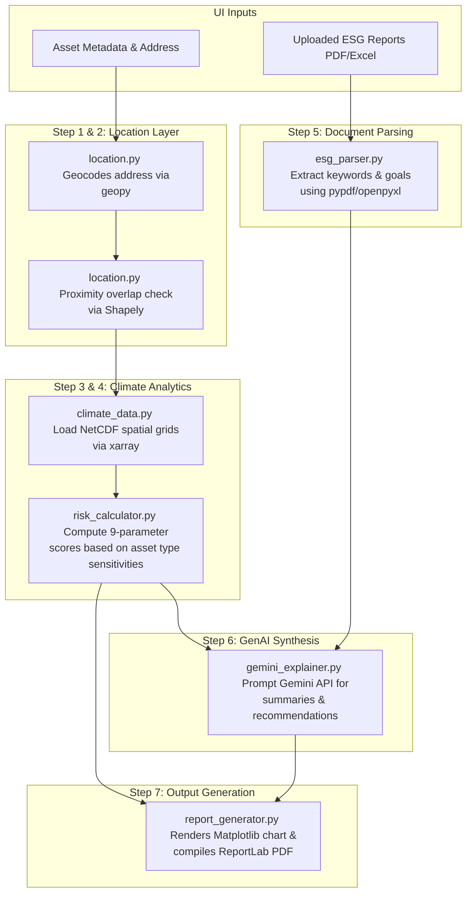

# Prana Earth - Predict Platform AI Analysis Engine

This folder contains the core climate intelligence, risk calculation, document analysis, and PDF reporting layer for the **Prana Earth - Predict Platform**. The interactive testing dashboard is powered by **Streamlit**.

---

## 1. System Architecture & Flow

The AI analysis pipeline executes sequentially across 7 distinct steps:



---

## 2. API Integrations (Current APIs Used)

To deliver location validation and textual summaries, the pipeline integrates with the following external interfaces:

1. **Geocoding API (geopy / Nominatim)**:
   - **Usage**: Converts textual user addresses (e.g., `"100 Cheapside, London"`) into precise coordinates (latitude & longitude) for spatial queries.
   - **Integration location**: [location.py](file:///U:/PW%20LEAPX/Prana%20Earth/Predict/ai_core/location.py).
   - **Fallback**: Incorporates a stable hash-based coordinate fallback for offline testing.
2. **Generative AI API (google-generativeai / Gemini)**:
   - **Usage**: Leverages Google's `gemini-1.5-flash` model to analyze risk matrix trends, align them with uploaded sustainability disclosures, generate executive explanations, and recommend adaptation projects.
   - **Integration location**: [gemini_explainer.py](file:///U:/PW%20LEAPX/Prana%20Earth/Predict/ai_core/gemini_explainer.py).
   - **Fallback**: Automatically falls back to high-fidelity structured text templates if `GEMINI_API_KEY` is missing.
3. **Climate Projections Datasets (xarray / netCDF4)**:
   - **Usage**: Interfaces with multidimensional gridded raster datasets (CMIP6 GCM models) at resolved coordinates.
   - **Integration location**: [climate_data.py](file:///U:/PW%20LEAPX/Prana%20Earth/Predict/ai_core/climate_data.py).
   - **Fallback**: Spatially-correlated stochastic simulations.

---

## 3. UI Fields & Inputs

The Streamlit web interface ([app.py](file:///U:/PW%20LEAPX/Prana%20Earth/app.py)) provides the following controls:

| Field Label | Input Control Type | Description / Logic |
| :--- | :--- | :--- |
| **Asset Name** | Text Input | Arbitrary identifier for the asset (e.g., *"London Data Center III"*). |
| **Asset Type** | Dropdown Select | Selects category mapping to risk vulnerability multipliers (e.g., *Data Center* has high cooling/water sensitivities). |
| **Address / Location** | Text Area | The raw address string passed to the geocoder. |
| **NGFS / SSP Climate Scenario** | Dropdown Select | Selects future warming path. Maps **Orderly** -> *SSP1-2.6*, **Disorderly** -> *SSP2-4.5*, **Hot House World** -> *SSP5-8.5*. |
| **Timeline Projections** | Multi-Select | List of target projection years. Supports any combination of `2030`, `2035`, `2040`, and `2050`. |
| **Upload Sustainability Report** | PDF File Uploader | Extracts corporate carbon, water, and energy commitments from PDF reports. |
| **Upload BRSR Disclosures** | Excel File Uploader | Extracts cell-level ESG targets from Excel disclosure sheets. |

---

## 4. Code Walkthrough (Module-by-Module)

* **[location.py](file:///U:/PW%20LEAPX/Prana%20Earth/Predict/ai_core/location.py)**:
  - Uses `Nominatim(user_agent=...)` to fetch coordinate lookups.
  - Implements `check_proximity_conflict()` utilizing `shapely.geometry.Point` to measure degree-to-meter distance bounds (warning threshold set to 5,000m).
* **[climate_data.py](file:///U:/PW%20LEAPX/Prana%20Earth/Predict/ai_core/climate_data.py)**:
  - Connects to local NetCDF (`.nc`) datasets via `xr.open_dataset` using spatial nearest-neighbor coordinate slicing.
  - Houses the stochastically correlated weather simulation engine using geographical inputs as seeds.
* **[risk_calculator.py](file:///U:/PW%20LEAPX/Prana%20Earth/Predict/ai_core/risk_calculator.py)**:
  - Evaluates scores across the 9 parameters: *Flood, Drought, Heat Stress, Wildfire, Cyclones, Water Stress, Sea Level Rise, Ocean Changes,* and *Biodiversity*.
  - Maps coefficients (e.g. `data_center` multiplier on Heat Stress is `1.45`, whereas `agriculture` is `1.30`).
  - Groups outputs into categorical bins: **Low** ($\le 35$), **Medium** ($36-70$), and **High** ($>70$).
* **[esg_parser.py](file:///U:/PW%20LEAPX/Prana%20Earth/Predict/ai_core/esg_parser.py)**:
  - Extracts raw text layouts from page chunks via `pypdf.PdfReader`.
  - Loops sheets and cell grids via `openpyxl`'s `iter_rows(max_row=200, max_col=20)`.
  - Groups contexts matching keywords into 5 categories: Carbon, Water, Energy, Biodiversity, and Policies.
* **[gemini_explainer.py](file:///U:/PW%20LEAPX/Prana%20Earth/Predict/ai_core/gemini_explainer.py)**:
  - Constructs structured prompts containing calculated risk matrices and parsed ESG context snippets.
  - Maps the highest average risk drivers to solutions in the Prana Earth adaptation project database.
* **[report_generator.py](file:///U:/PW%20LEAPX/Prana%20Earth/Predict/ai_core/report_generator.py)**:
  - Draws scenario trend plots via Matplotlib and Seaborn.
  - Builds PDF document templates via ReportLab flowables, adding custom layout formats, tables, and clickable hyperlinks.
* **[app.py](file:///U:/PW%20LEAPX/Prana%20Earth/app.py)**:
  - Serves the layout and coordinates execution. Renders the interactive location preview map and outputs color-coded risk grid matrices.

---

## 5. Execution Instructions

### A. Run Automated Unit Tests
To verify all calculations and fallback states, run:
```bash
.\.venv\Scripts\python.exe -m unittest discover -s Predict/tests -p "test_*.py"
```

### B. Run End-to-End CLI Pipeline
To run a test assessment on Phoenix, AZ, and output the PDF report directly:
```bash
.\.venv\Scripts\python.exe main.py
```

### C. Launch Streamlit Web UI Dashboard
To run the interactive playground:
```bash
.\.venv\Scripts\streamlit run app.py
```
*Access the local web dashboard at `http://localhost:8501`.*
